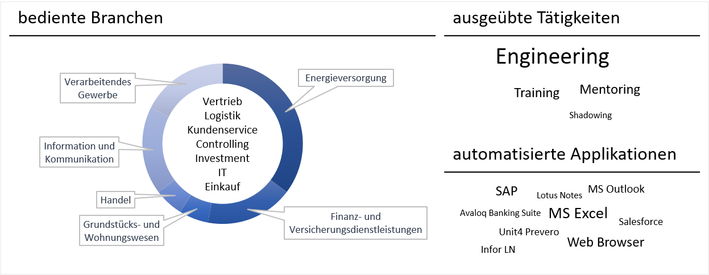

<h2 id='projects-robotic-process-automation'>RPA</h2>

Einen &Uuml;berblick meiner Aktivit&auml;ten in RPA verschafft folgende Infographic.

Ich bin haupts&auml;chlich beteiligt an der Entwicklung von Software-L&ouml;sungen unter Anwendung moderner Technologien. Die Unternehmungen erstrecken sich hierbei &uuml;ber die DACH-Region. Neben dem Engineering helfe ich auch gerne bei Gestaltung und Umsetzung der initialen Einf&uuml;hrung von RPA mit, halte Trainings und Workshops, und erstelle DevOps-Prozesse zur Integration von RPA in die Aufbau- und Ablaufstruktur des Unternehmens.

<h3 id='projects-robotic-process-automation-samples'>Auswahl an Projekten</h3>

<ul>
<li>Erstellung von Folgeangeboten zu bestehenden Stromvertr&auml;gen</li>
<li>Bearbeitung von Beschwerden f&uuml;r zu sp&auml;t als auch nicht erhaltene Abonnements</li>
<li>Pflegen von Preiskonditionen f&uuml;r Materialstammdaten</li>
<li>Ausweis der TER (Total Expense Ratio) von Fonds und ETFs</li>
</ul>

<h2 id='projects-machine-learning-data-science'>Machine Learning / Data Science</h2>

Der Einsatz von Machine Learning kommt erst in Verbindung mit anderen Technologien, wie RPA, zustande. Projekte mit diesem Schwerpunkt sind &ouml;ffentlich in einem GitHub Repository zu finden. Eine &Uuml;bersicht aller Projekte und deren Inhalt gibt diese <a href='https://github.com/damilo/project.ml/blob/master/readme.md' target='_blank'>readme.md</a>.

<h3 id='projects-machine-learning-data-science-samples'>Auswahl an Projekten</h3>

<ul>
<li>Filtern von Emails nach Spam oder Ham</li>
<li>Klassifizierung von Kundenbeschwerden</li>
<li>Bestimmung vorraussichtlicher Ausgaben von Kunden</li>
</ul>

